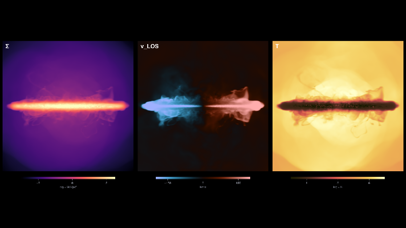

# Gallery: recipes and shared workflows

Complete, self-contained notebooks that do one thing end to end. Download one, change the path to
your simulation and the output number, and run it.

Each recipe lives in its own numbered folder holding the notebook, the environment it was written
against, and the media it produced:

```
001_coin_flip_movie/
  coin_flip_movie.ipynb
  Project.toml        which packages, and which versions are allowed
  Manifest.toml       the exact versions that ran, down to every dependency
  media/              the figures, the animation, and the thumbnail for the card
```

The first cell activates that environment, so running the notebook uses those versions and not
whatever happens to be installed on your machine. Together with the provenance line in each
notebook's header table, which records the Mera build and the exact snapshot, that is what makes a
result reproducible rather than merely described. See
[Reproducibility](https://manuelbehrendt.github.io/Mera.jl/stable/reproducibility/).

The number is just the order recipes arrived. It never changes, so `001` stays a stable way to
refer to one even if its title does not.

Notebooks carry no stored outputs: you produce them by running.

| | recipe | reads | what it makes | author | status |
|---|---|---|---|---|---|
| | [`TEMPLATE/`](TEMPLATE) | any | the skeleton to start from, with a cell that prints your attribution block | | |
|  | [`001_coin_flip_movie/`](001_coin_flip_movie) | RAMSES | a three-panel animation, Σ / v_LOS / T, camera tipping face-on to edge-on, turning in place, tumbling like a spun coin, falling flat. Seamless loop. Needs CairoMakie, ColorSchemes, ffmpeg. | Manuel Behrendt | checked 2026-09-11 |
|  | [`002_word_in_a_galaxy/`](002_word_in_a_galaxy) | RAMSES | the word MERA carved out of a gas disc with region algebra, and the same letters kept instead, face-on, at 60° and repeated on the stars, plus a movie of the word turning, flipping and zooming. A stencil font built from `Cuboid`s. Needs CairoMakie and ffmpeg. | Manuel Behrendt | contributed 2026-09-16 |

**Reads** is the simulation code a recipe was written against. Most of Mera's analysis is
code-agnostic, so a RAMSES recipe usually transfers with no change beyond the path. Readers for
codes other than RAMSES live on the `multicode` branch and are not part of a 1.x release, so a
recipe that needs one should say so in its first paragraph.

If this grows enough that the table stops being scannable, the recipes group into one subfolder per
code. A flat list of numbered folders is easier to browse until then.

## Writing one

The format that works, from the recipe above:

1. **Two lines to change, at the top.** Path and output number. If a reader has to hunt through the
   notebook for what is specific to your data, they will not run it.
2. **Explain the decisions, not the syntax.** Why a fixed grid, why a dark-centred diverging map for
   a signed quantity. Anyone can read `projection(...)`; nobody can guess why the frame has to be
   fixed until their movie pulses.
3. **Say what goes wrong.** The traps are the most valuable part. Write down what you tried that
   failed and why.
4. **End with a short version.** Once the choices are made, Mera's own shorthands carry the
   plumbing. Showing both teaches the concepts first and the compact form second.
5. **State the cost.** Memory, time per frame, how to try a cheap version first.
6. **Pin the environment.** Always commit `Project.toml` with `[compat]` bounds. From inside your
   recipe folder:

   ```bash
   julia --project=. -e 'using Pkg; Pkg.add(["Mera", "CairoMakie"]); Pkg.status()'
   ```

   Add whichever packages your recipe uses, then set `[compat]` to the versions `Pkg.status()`
   reports. Committing the `Manifest.toml` as well is encouraged here, and is what makes the
   environment exact rather than merely bounded. See **Should I commit the Manifest?** below.
7. **Make a thumbnail.** One picture that says what the recipe produces. Mera sizes it for you,
   see below.

## Should I commit the Manifest?

For a recipe here, yes, and the reason is worth knowing because the answer is different for a
package.

Julia's Pkg documentation is permissive rather than prescriptive: it says an independent project
lets you "check in a `Project.toml`, and even a `Manifest.toml` if you wish, into version control".
If a project does contain a manifest, `Pkg.instantiate()` installs the packages "in the same state
that is given by that manifest". That is exactly what a shared analysis wants, so commit it.

The opposite convention, gitignoring the manifest, belongs to **packages**. A library has to work
against a range of dependency versions, so pinning one set would be wrong. That is community
practice rather than a rule written in the Pkg manual, and it does not apply to a recipe: a recipe
is an application, and its job is to reproduce one result.

Two honest limits, worth a line in your notebook rather than silence:

- **A manifest records the Julia version it was resolved on.** A reader on a different Julia may
  have to re-resolve, and the pin is then no longer exact. From Julia 1.11 you can ship a
  version-specific file, `Manifest-v1.11.toml`, which Julia prefers over a plain `Manifest.toml`,
  so several Julia versions can each have their own.
- **It pins Julia packages, nothing else.** The coin-flip recipe needs ffmpeg, and no manifest
  captures that. Say in your notebook what else has to be on the machine.

## Making the thumbnail

Every recipe shows a card on the [gallery page](https://manuelbehrendt.github.io/Mera.jl/stable/gallery/),
and the card needs a picture. They all have to be the same size or the grid stops looking like a
grid, so Mera does the sizing for you. There is nothing to download: `makethumb` ships with Mera.

```julia
using Mera
makethumb("media/my_figure.png", "media/my_recipe_thumb.png")
```

From the gallery folder there is a wrapper that knows the layout, so it finds your recipe's
`media/` and names the file after your notebook:

```bash
julia make_thumb.jl 002_my_recipe                                  # find a picture in media/
julia make_thumb.jl 002_my_recipe --from 002_my_recipe/media/fig.png
julia make_thumb.jl my_recipe --frame 0.25                         # number optional if unambiguous
```

It writes `002_my_recipe/media/<notebook>_thumb.png` at 800 by 450. Points worth knowing:

- It takes a **saved figure or a gif**, from your recipe's `media/`. Gallery notebooks are stored
  without outputs, so there is no picture inside the `.ipynb`: it has to come from a file your
  notebook wrote.
- **A movie is not read.** Decoding video would add a large binary dependency to every Mera
  install for a job done once, so save a frame from the code that made the movie, or point it at
  the preview gif. A rendered frame is the better source anyway: it is sharper and compresses
  smaller than an upscaled gif.
- From an animation it takes a frame **part-way in** (`--frame`, default 0.4). Frame zero of a
  movie that opens on a static pose is usually the dullest frame in it.
- The **whole picture is kept**, padded to shape with your figure's own background colour, so a
  wide multi-panel figure keeps its outer panels. `--crop` fills the card instead and loses the
  edges; check the result if you use it.
- Set `MERA_DIR` to a Mera.jl checkout and it copies the thumbnail into the docs as well.

The wrapper runs in your recipe's own environment, which already pins Mera, so there is nothing
extra to install.

## Share the workflow behind your paper

The best recipes already exist: the analysis you wrote for a publication. Putting it here gives
your work a second life, since the workflow keeps being read long after the paper stops being new.
It lets other people reproduce your method on their own data rather than guess at it from a figure
caption. And it teaches the part that never reaches the paper, which quantity to weight by, what
you tried first that did not work.

Link it from the paper, and cite your own work in the notebook. Nothing here has to be polished or
general: one thing, on one kind of data, with the reasoning written down, beats a framework nobody
runs.

## Contributing

Open a [pull request](https://github.com/ManuelBehrendt/Notebooks) adding a recipe folder here and a
row to the table, or post it in
[Discussions](https://github.com/ManuelBehrendt/Mera.jl/discussions) and it can be added for you.

**Every recipe says who wrote it.** A gallery cannot promise shared code is correct; it can make
each recipe attributable. The template prints this block, and only the first two lines are typed:

```
Author       Jane Doe, University of Somewhere
Contact      jane.doe@somewhere.edu
Reads        RAMSES
Mera         1.8.0, Julia 1.12     (or: 1.9.0-DEV (dev multicode @ 3a91f2c), Julia 1.12)
Provenance   Mera v1.8.0 | AV05CD/output_00390 | 445.9 Myr | L=48.0 ndim=3 lmin=6 lmax=12
Status       contributed 2026-09-11
```

`Reads` is `info.simcode`, `Mera` is `mera_build()`, and `Provenance` is `provenance_string(...)` on
the data the recipe read, so none of them can be written without having run it. The `Mera` line
matters if you were on a development version: `pkgversion` reports the same "1.8.0" whether it came
from the registry or from a checkout of a branch, and `mera_build()` names the branch and commit
instead, marking an uncommitted working tree too.

**Start from [`TEMPLATE/`](TEMPLATE)**: copy the folder to `NNN_your_recipe/`, taking the next free
number. It has the skeleton, a `Project.toml` to fill in, and the cell that prints the block.

Recipes are **contributed** until someone else has run them, then **checked** with the date.

Two requests, so a reader is never stuck:

- **Runnable on data the reader can get**, either their own simulation or one of Mera's public test
  simulations via `download_testdata()`. A recipe that only runs on data nobody else has is a
  showcase; label it as one.
- **Say which Mera version you used**, and roughly what the run costs.
